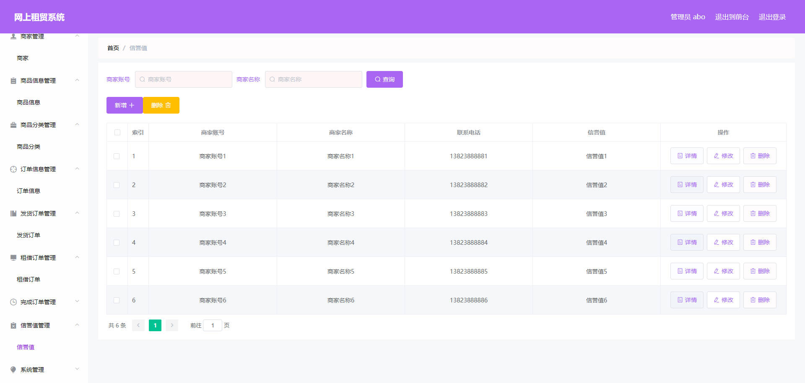

# 基于Springboot的网上租赁系统

## Springboot-0038


## 技术栈

Springboot mybatisplus vue mysql maven


## 数据库表(17张)


## 功能介绍

```properties
用户：用户在系统前台可查看系统信息，包括首页、商品信息等，注册登录后主要功能模块包括购物车、个人中心、我的地址、订单信息管理、发货订单管理、租借订单管理、完成订单管理以及我的收藏管理，

管理员：管理员登录后可对系统进行全面的管理，主要功能模块包括个人中心、用户管理、商家管理、商品信息管理、商品分类管理、订单信息管理、发货订单管理、租借订单管理、完成订单管理、系统管理以及订单管理。

商家：商家注册登录后主要功能模块包括个人中心、商品信息管理、订单信息管理。发货订单管理、租借订单管理、完成订单管理以及订单管理。
```


## 图片

### 前台


### 后台


### 





## 访问路径

### 前台

```properties
http://localhost:8080/springbootyf10w/front/pages/login/login.html

账号 用户6
密码 123456
```

### 后台

```properties
http://localhost:8080/springbootyf10w/admin/dist/index.html#/login

账号 admin
密码 admin
```


## 功能图


## 文档目录


## 打赏或交流


